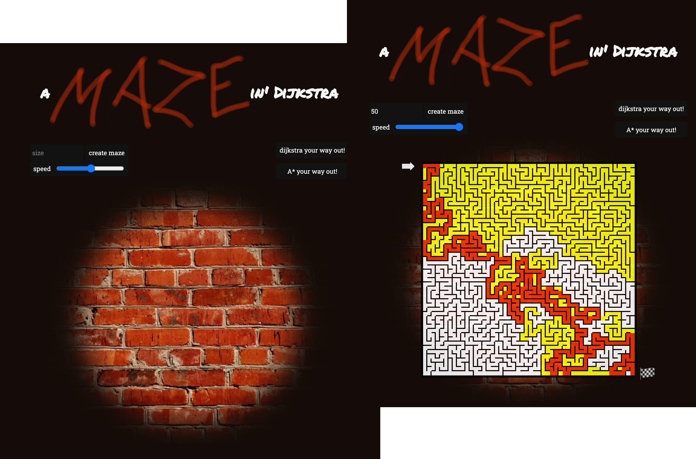

# aMAZEin' Dijkstra

## Screenshots

Build a maze and let Dijkstra or A\* find your way out.

## Getting started

0. test drive: [aMAZEin Dijkstra](https://atsteinberg.github.io/aMAZEin-Dijkstra/)

1. get repo: <code>git clone https://github.com/atsteinberg/aMAZEin-Dijkstra.git</code>
2. install dependencies: <code>npm i</code> (if you haven't installed node and npm, the node package manager, do that first: [install npm](https://www.npmjs.com/get-npm))
3. serve static page on server
4. enjoy

## Built with:

- vanilla javascript, including
  - priority queue, implemented from scratch as linked binary heap
  - Dijkstra algorithm, implemented from scratch
  - A\* algorithm, implemented from scratch
- [blood, sweat & tears](https://bloodsweatandtears.com/)

## Developer

- Alex Steinberg: [github](https://github.com/atsteinberg) – [linkedin](https://www.linkedin.com/in/alexander-steinberg-7b7299194) – [web](atsteinberg.github.io)
